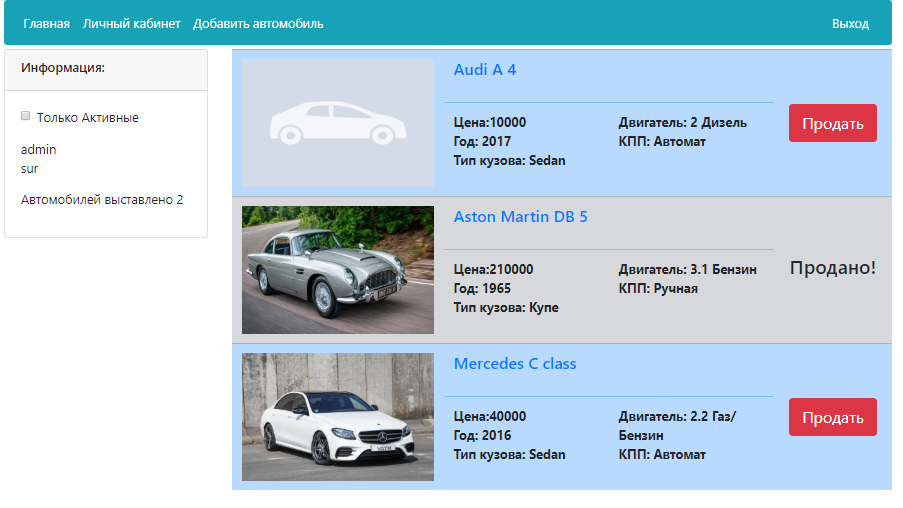
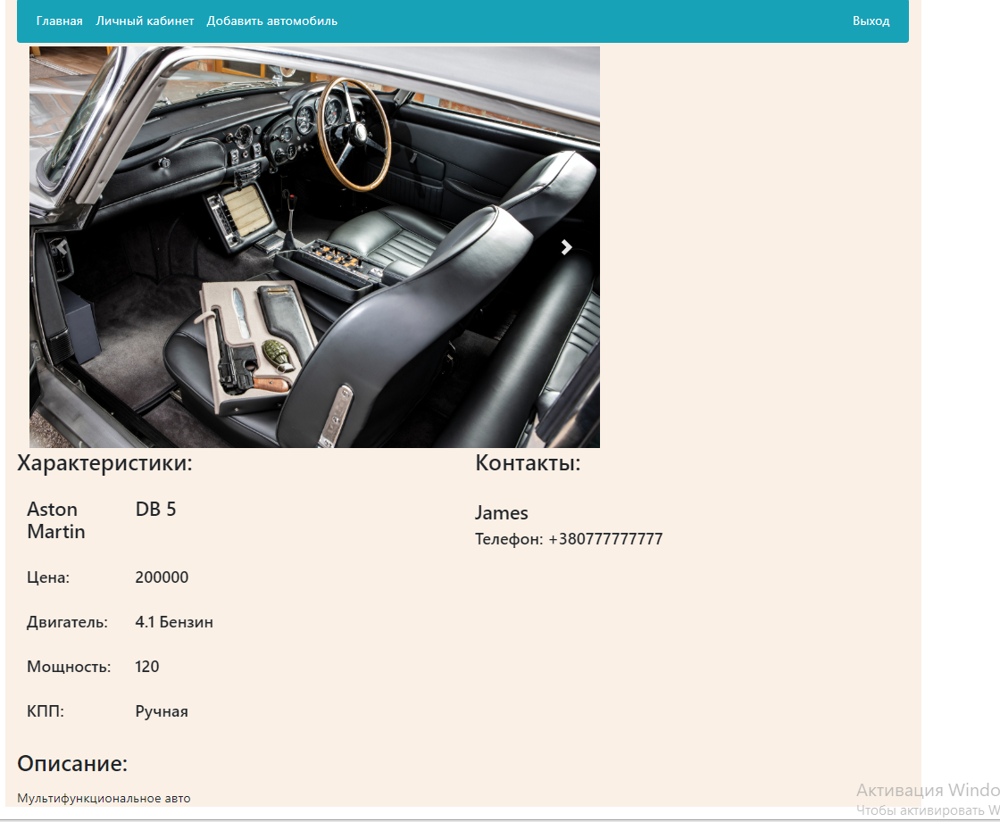
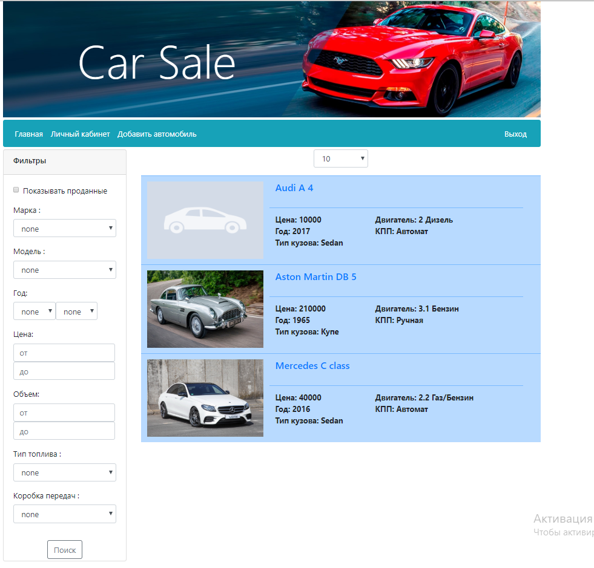

# Приложение "площадка продажи машин" (PostgreSQL, Hibernate, JavaServlet, ApacheTomcat, JavaScript, Ajax, BootStrap)
Постановка задачи:
Cоздать приложение удовлетворющее свойствам :
 1. Основная страница содержит все объявления о продаже машин. 
 2. Реализован личный кабинет, где пользователь может просматривать информацию о своих авто
и деактивировать их.
 3. В форме добавления объявления при изменении полей так же меняются списки выбора зависимых от них полей
 4. Реализована фильтрация автомобилей по критериям. (JPA Criteria).

<h3>Личный кабинет пользователя</h3>

<h3>Просмотр авто</h3>

<h3>Общий вид</h3>

<h3>Поиск</h3>
