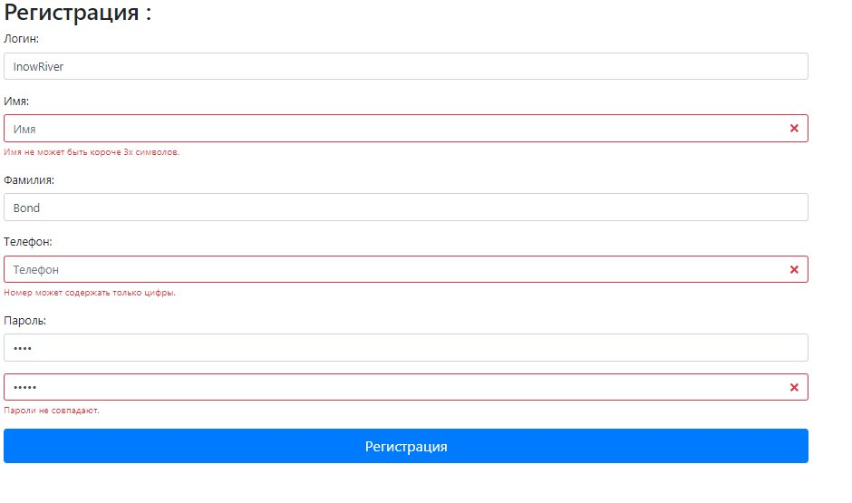
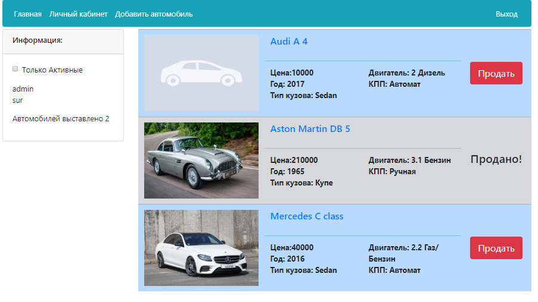
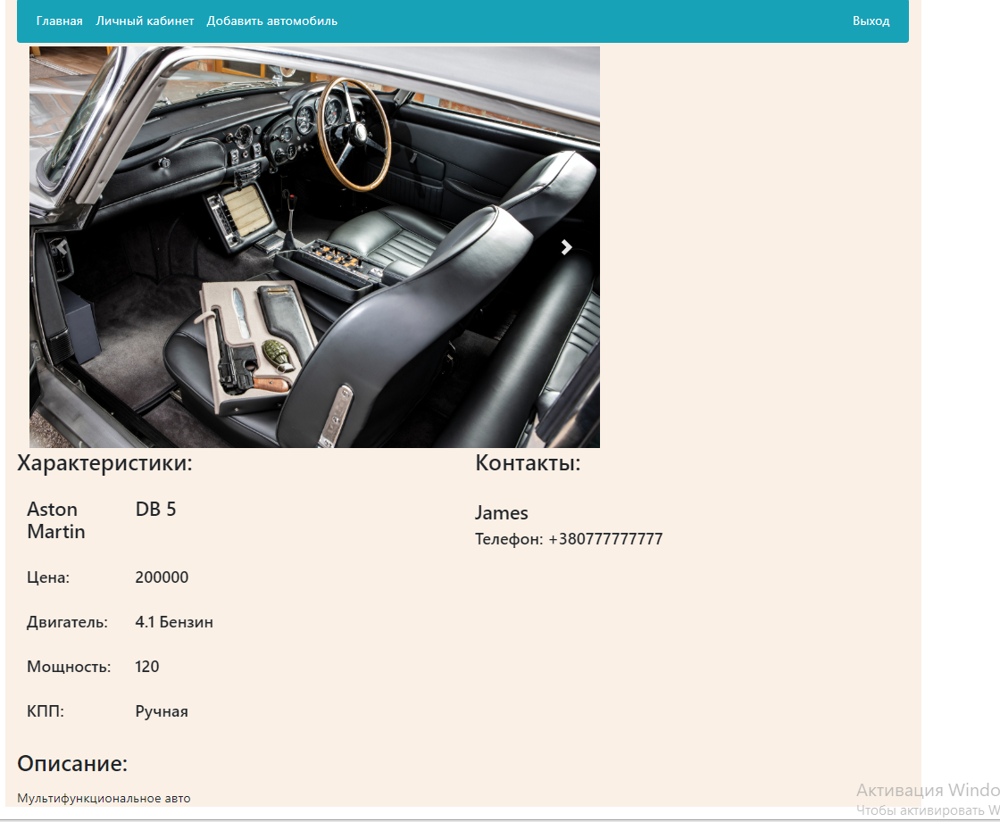
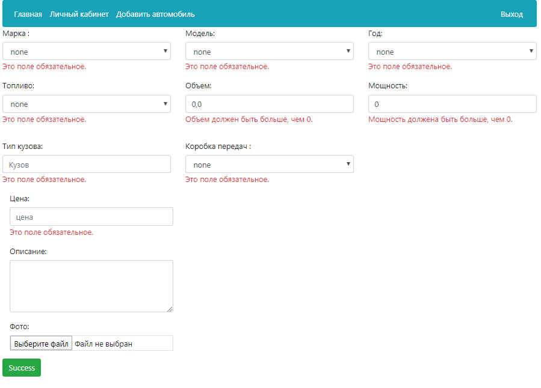
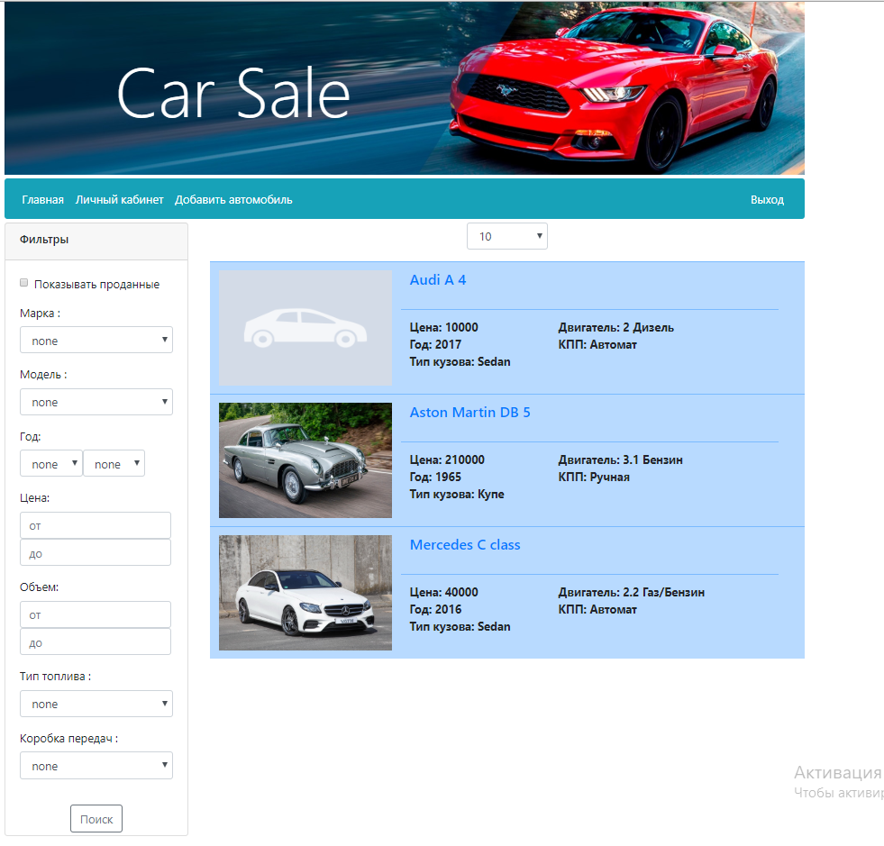
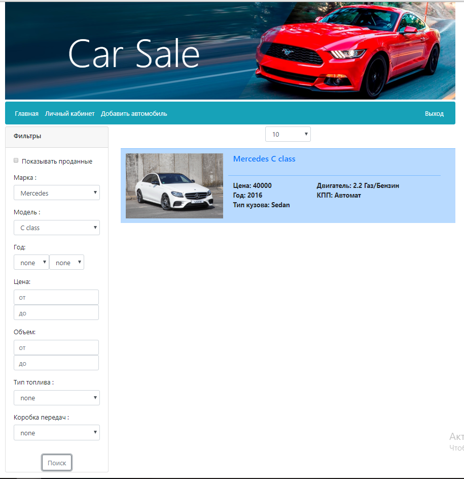

# Приложение "площадка продажи машин" (SPRING) (Spring MVC, Spring Data, Spring Security, Spring Boot, Hibernate, PostgreSQL, Ajax, BootStrap)</h2>
Постановка задачи:
Cоздать приложение удовлетворющее свойствам :
 1. Основная страница содержит все объявления о продаже машин. 
 2. Реализован личный кабинет, где пользователь может просматривать информацию о своих авто
и деактивировать их.
 3. В форме добавления объявления при изменении полей так же меняются списки выбора зависимых от них полей
 4. При добовлении автомобиля происходит проверка на стороне сервера что все поля выбраны
 5. Используется Spring.
 6. Добавлена форма регистрации пользователей с валидацией ввода на стороне сервера.
 7. Реализована локализация текста ошибок валидации формы регистрации.
 8. Реализована фильтрация автомобилей по критериям. (JPA Criteria).
<h3>Регистрация пользователя</h3>

<h3>Личный кабинет пользователя</h3>

<h3>Просмотр авто</h3>

<h3>Авторизация пользователя</h3>

<h3>Общий вид</h3>

<h3>Поиск</h3>
